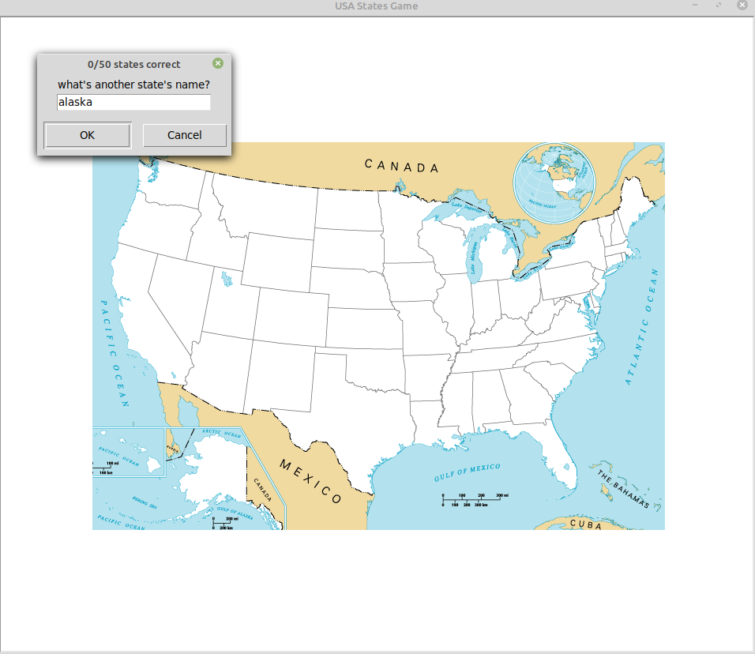

# Day25

## Lessons learned today

- reading a file with pandas
```
data = pandas.read_csv('file name')

```
- make column data into a list
```
data['column name'].to_list()
```


## Project to solidify material learned: 

### Preview:
||


### USA_states_game

> Created using the turtle module... In this game you have to guess as many states as you can and you can't guess all of them no problem just type "exit" and a file will be generated to show you the ones you failed to get right

> Using the open function to read and update files... Here it is used to automate invitation letters to be sent to friends.


## How to run this on your device

- Clone this repository
```
git clone https://github.com/kingdreamerr/Day25_USA_states_game.git
```
- cd into the repo
```
cd Day25_USA_states_game
```

- Paste the following in the terminal 
```
python3 main.py
```